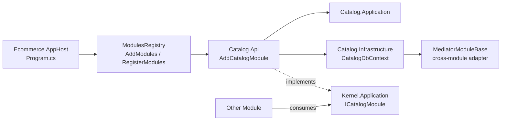
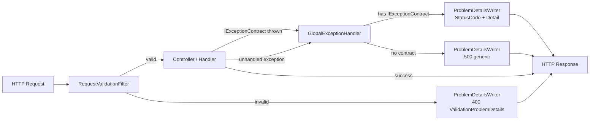
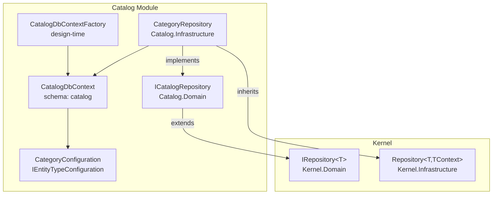
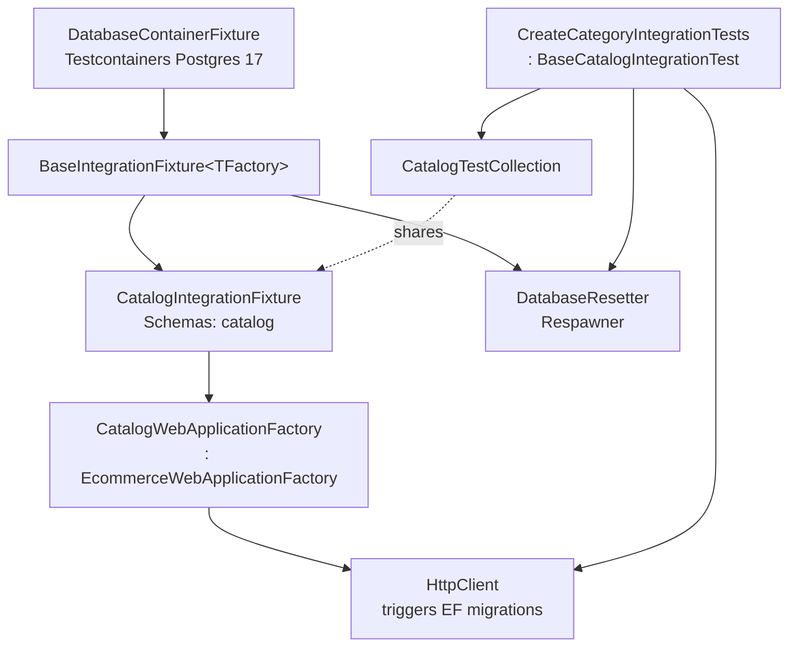

<h1 align="center">Ecommerce</h1>
<p align="center">
  <a href="https://github.com/marcuscfarias/ecommerce-platform/issues"></a>
  <a href="https://github.com/marcuscfarias/ecommerce-platform"></a>
  <a href="https://opensource.org/licenses/MIT"></a>
 <a href="https://github.com/marcuscfarias/ecommerce-platform/graphs/contributors"></a>
  <a href="https://github.com/marcuscfarias/ecommerce-platform/network/members"></a>
  <a href="https://github.com/marcuscfarias/ecommerce-platform/stargazers"></a>
</p>

## Index

<!-- TOC -->

* [Index](#index)
* [1. About this project](#1-about-this-project)
    * [1.1 Description](#11-description)
* [2. Screenshots or Demo](#2-screenshots-or-demo)
* [3. Functionalities](#3-functionalities)
* [4. Getting started](#4-getting-started)
* [5. Technologies, Patterns and Architecture discussion](#5-technologies-patterns-and-architecture-discussion)
* [6. Contributing](#6-contributing)
* [8. License](#8-license)

<!-- TOC -->

## 1. About this project

This is a personal, learning-oriented backend that pretends to be the brain of an online store. It is not trying to become a production e-commerce site — it is trying to become a place where the patterns that real systems wrestle with can be practiced end to end: clear module boundaries, validation, error handling, integration testing with real databases, CI, and (eventually) async messaging and a service extraction. The goal is for the code to be readable as a reference: open a folder, recognize the shape, and learn something useful.

Everything here is built to grow. The codebase deliberately starts as a Modular Monolith with seams already drawn so that the next phases — DDD tactical patterns, event-driven communication, and a Payment microservice — can be introduced without rewriting boundaries.

#### 1.1 Description

**What is built today.** A Modular Monolith in .NET 10 / ASP.NET Core 10 backed by PostgreSQL 17 and Entity Framework Core. Each business domain (Catalog, Auth, Orders, Shipping, Payment, Notifications) is modeled as an independent module with its own DbContext, its own Postgres schema, and a small contract surface for talking to other modules through `Ecommerce.Kernel`. CQRS is implemented with MediatR, request validation with FluentValidation, and API documentation is rendered with Scalar UI on top of OpenAPI. Integration tests run against a real Postgres instance via Testcontainers and reset state between tests with Respawner.

**Why and where it is going.** The project is staged to evolve in four phases:

| Phase | Description |
|---|---|
| **1. Modular Monolith** | Logical module boundaries, separate DbContexts/schemas, synchronous cross-module communication via shared interfaces. *(current)* |
| **2. DDD** | Tactical patterns within modules — aggregates, value objects, domain events, formalized bounded contexts. |
| **3. Event-Driven** | Message broker (RabbitMQ + MassTransit) for async inter-module communication via integration events, replacing synchronous cross-module calls. Eventual consistency between modules. |
| **4. Microservice Extraction** | Extract the **Payment** module into an independent deployable with its own database, CI pipeline, and API. Communicates with the monolith exclusively through integration events. |

This roadmap is the reason some pieces look heavier than a single CRUD service would warrant — per-module DbContext, cross-module interfaces, mediator-backed adapters. They are seams placed on purpose.

## 2. Screenshots or Demo

_Coming soon._

## 3. Functionalities

<div align="center">

| Id |           Description            |     Status     |
|:--:|:--------------------------------:|:--------------:|
| 1  |       Category Management        |    🟢 Done     |
| 2  |      CI/CD (Github Actions)      | 🟡 In progress |
| 3  |          Authentication          | 🟡 In progress |
| 4  |          Authorization           |    🔴 To do    |
| 5  |        Product Management        |    🔴 To do    |
| 6  |         Azure Deployment         |    🔴 To do    |
| 7  |      Dev & Prod Environment      |    🔴 To do    |
| 8  |               Logs               |    🔴 To do    |
| 9  |    Validation rules in Domain    |    🔴 To do    |
| 10 | (kept empty for future addition) |    🔴 To do    |

</div>

## 4. Getting started

### Prerequisites

* [.NET 10 SDK](https://dotnet.microsoft.com/download)
* [Docker](https://www.docker.com/) with Docker Compose

### Run locally with Docker Compose

1. Clone the repository.
2. Create a `.env` file under `src/` from the provided example:

   ```bash
   cd src
   cp .env.example .env
   ```

   Edit `.env` and set `POSTGRES_PASSWORD` (and the matching password inside `ConnectionStrings__EcommerceDb`) to something other than the default.

3. Bring the stack up:

   ```bash
   docker compose up --build
   ```

   This boots two containers:

   * `ecommerce-db` — PostgreSQL 17 with a persistent volume.
   * `ecommerce-api` — the API (`Ecommerce.AppHost`) listening on `http://localhost:8080` and `https://localhost:8081`.

   EF Core migrations are applied on startup so the database is ready as soon as the API answers.

4. Open the **Scalar UI** at [`http://localhost:8080/scalar/v1`](http://localhost:8080/scalar/v1) to explore endpoints.

### Run tests

```bash
cd src
dotnet test
```

Integration tests require Docker to be running — Testcontainers spins up a PostgreSQL 17 instance per fixture, EF migrations are applied through a `WebApplicationFactory`, and `Respawner` clears the schema between tests so each one starts from a known state. See [5.4 Integration Tests](#54-integration-tests) for the composition.

## 5. Technologies, Patterns and Architecture discussion

### 5.0 Tech stack

* **.NET 10 / ASP.NET Core 10 / C#** — API runtime and framework.
* **PostgreSQL 17** with **Entity Framework Core** — relational store, migrations and data access.
* **MediatR** — CQRS dispatch for commands and queries.
* **FluentValidation** — declarative request validation.
* **Scalar UI** (over OpenAPI) — interactive API documentation.
* **xUnit**, **NSubstitute**, **Bogus**, **Shouldly**, **Testcontainers**, **Respawner** — testing toolchain.
* **Docker** + **Docker Compose** — containerization.
* **GitHub Actions** — CI (build, unit tests, integration tests, Docker image validation, commit message linting).

### 5.A Per-feature technical discussion

Only features that are `Done` or `In progress` are discussed here. Items still `To do` live in the table above. Category Management is a plain CRUD and is omitted on purpose — the architectural building blocks below already explain how a CRUD is wired up in this project.

#### CI/CD (GitHub Actions)

Three workflows live under `.github/workflows/`:

* **`ci.yml`** runs on every push and on pull requests targeting `main`. It runs in two jobs: `build-and-unit-tests` (restore, build in Release, run only tests whose fully-qualified name contains `UnitTests`) and `integration-tests` (same, but filtering on `IntegrationTests` and depending on the first job). NuGet packages are cached by `*.csproj` hash. Test results are uploaded as TRX artifacts only on failure.
* **`docker.yml`** builds the production image from `src/Ecommerce.AppHost/Dockerfile` on changes under `src/**`. It does not push — it validates that the image still builds, with GHA cache.
* **`commitlint.yml`** lints PR commit messages against the Conventional Commits config at the repo root (`commitlint.config.cjs`, `commitlinterrc.json`).

What is still open: deployment workflows (Azure) and a release pipeline.

### 5.B Architectural building blocks

Each subsection below corresponds to one of the hand-drawn architecture sketches that drove the design.

#### 5.1 Modules

`Ecommerce.AppHost` is the composition root. Each module ships an `Api` project that exposes two extension methods — `Add{Module}Module(IServiceCollection, IConfiguration)` and `Use{Module}Module(IApplicationBuilder)` — both invoked uniformly by `ModulesRegistry.AddModules` / `RegisterModules`. Modules never reference each other directly: cross-module communication goes through interfaces in `Ecommerce.Kernel.Application` (e.g. `IModule`, `ICatalogModule`), and the implementing module ships an internal mediator-backed adapter that extends `MediatorModuleBase` so consumers see a typed contract instead of `ISender`.



#### 5.2 API Validation

Two complementary paths produce a [RFC 7807](https://datatracker.ietf.org/doc/html/rfc7807) `ProblemDetails` response — one for invalid input, one for thrown exceptions. Both go through a single writer (`ProblemDetailsWriter`) so the response shape stays consistent.

1. **Request body validation.** `RequestValidationFilter` is registered globally in `ApiModule.AddApiModule`. For each request DTO, it resolves the matching `IValidator<T>` from DI, calls `ValidateAsync`, and on failure short-circuits the pipeline with a `400 ValidationProblemDetails` written by `ProblemDetailsWriter` — the controller action never runs.
2. **Controlled exceptions.** Handlers throw exceptions that implement `IExceptionContract` (e.g. `ResourceNotFoundException` → `404`, `BusinessRuleValidationException` → `409`). `GlobalExceptionHandler` (`IExceptionHandler`) picks up the contract, reads `StatusCode` and `Message`, and produces a `ProblemDetails` through the same writer. Anything that does not implement the contract falls back to a generic `500` with no leakage of internal details.



#### 5.3 Repository

The Kernel ships the abstractions: `IRepository<T>` in `Ecommerce.Kernel.Domain.Repositories` and an abstract `Repository<T, TContext>` base in `Ecommerce.Kernel.Infrastructure.Persistence` that handles `DbSet<T>` access and pagination via `PaginationSettings`. Each module owns its own DbContext — `CatalogDbContext` calls `modelBuilder.HasDefaultSchema("catalog")` and applies `IEntityTypeConfiguration<>` implementations from the assembly so each entity declares its own mapping. The module also declares its own repository interface (`ICatalogRepository`) and implements it on top of the Kernel base (`CategoryRepository : Repository<Category, CatalogDbContext>, ICatalogRepository`). A `CatalogDbContextFactory` (`IDesignTimeDbContextFactory<CatalogDbContext>`) reads the `EcommerceDb` connection string from `Ecommerce.AppHost/appsettings.Development.json` so the EF CLI can generate migrations without booting the host.



#### 5.4 Integration Tests

The integration test stack composes a few small pieces, each with one responsibility:

* **`DatabaseContainerFixture`** boots a `postgres:17` container via Testcontainers and exposes its connection string.
* **`BaseIntegrationFixture<TFactory>`** (Kernel) owns the container, instantiates the per-module `WebApplicationFactory`, calls `CreateClient` (which applies EF migrations during host startup), and then constructs a `DatabaseResetter` over the schemas the module declares.
* **`EcommerceWebApplicationFactory`** is an abstract base over `WebApplicationFactory<IApiMarker>`. Its `ConfigureWebHost` injects the container connection string into in-memory configuration so the API points at the test database. Each module supplies a concrete factory (e.g. `CatalogWebApplicationFactory`).
* **`DatabaseResetter`** wraps `Respawner` with `DbAdapter.Postgres` and only the module-owned schemas, giving each test a clean slate via `ResetAsync`.
* **`CatalogTestCollection`** is an xUnit `[CollectionDefinition]` with `ICollectionFixture<CatalogIntegrationFixture>` so the fixture (and its container) is shared across the whole test class set. `BaseCatalogIntegrationTest` hides the wiring and exposes `Client`, `ResetDatabaseAsync()` and `SeedAsync<CatalogDbContext>()` to test classes.



## 6. Contributing

You can send how many PR's do you want, I'll be glad to analyze and accept them! And if you have any question about the
project just ask...

## 8. License

This project is licensed under the MIT License - see
the [LICENSE.md](https://github.com/MarcusCFarias/ecommerce-platform/blob/main/LICENSE) file for details
