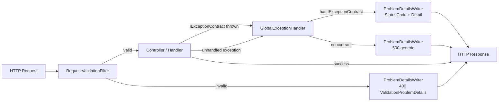

<h1 align="center">Ecommerce</h1>
<p align="center">
  <a href="https://github.com/marcuscfarias/ecommerce-platform/issues"></a>
  <a href="https://github.com/marcuscfarias/ecommerce-platform"></a>
  <a href="https://opensource.org/licenses/MIT"></a>
 <a href="https://github.com/marcuscfarias/ecommerce-platform/graphs/contributors"></a>
  <a href="https://github.com/marcuscfarias/ecommerce-platform/network/members"></a>
  <a href="https://github.com/marcuscfarias/ecommerce-platform/stargazers"></a>
</p>

## Summary

<!-- TOC -->

* [Summary](#Summary)
* [1. About this project](#1-about-this-project)
* [2. Screenshots or Demo](#2-screenshots-or-demo)
* [3. Getting started](#3-getting-started)
* [4. Functionalities](#4-functionalities)
* [5. Implementation details](#5-implementation-details)
* [6. Contributing](#6-contributing)
* [7. License](#7-license)

<!-- TOC -->

## 1. About this project

Ecommerce is a personal portfolio project built in ASP.NET Core to practice new trends and technologies in modern
backend development. It is **UNDER CONSTRUCTION** and intentionally **evolutionary**, shipped today as a **modular
monolith open for expansion**. The project offers hands-on experience with modern tools, patterns and methodologies,
promoting growth and adaptability, exploring efficient coding practices, clear architectural decisions and project
management skills that enhance my ability to deliver high-quality software solutions.

## 2. Screenshots or Demo

_Coming soon._

## 3. Getting started

### Prerequisites

* [.NET 10 SDK](https://dotnet.microsoft.com/download)
* [Docker](https://www.docker.com/) with Docker Compose

### Run locally with Docker Compose

1. Clone the repository.
2. Create a `.env` file under `src/` from the provided example:

   ```bash
   cd src
   cp .env.example .env
   ```

   Edit `.env` and set `POSTGRES_PASSWORD` (and the matching password inside `ConnectionStrings__EcommerceDb`) to
   something other than the default.

3. Bring the stack up:

   ```bash
   docker compose up --build
   ```

   This boots two containers:

    * `ecommerce-db` — PostgreSQL 17 with a persistent volume.
    * `ecommerce-api` — the API (`Ecommerce.AppHost`) listening on `http://localhost:8080` and `https://localhost:8081`.

   EF Core migrations are applied on startup so the database is ready as soon as the API answers.

4. Open the **Scalar UI** at [`http://localhost:8080/scalar/v1`](http://localhost:8080/scalar/v1) to explore endpoints.

### Run tests

```bash
cd src
dotnet test
```

Integration tests require Docker to be running. See [5.4 Integration Tests](#54-integration-tests) for the composition.

## 4. Functionalities

Each module groups one or more features. Cross-cutting items are not tied to a single
module.

<div align="center">

| Id |         Module         |               Feature               |     Status     |
|:--:|:----------------------:|:-----------------------------------:|:--------------:|
| 1  |        Catalog         |         Category Management         |    🟢 Done     |
| 2  |          Auth          |           User Management           |    🟢 Done     |
| 3  |          Auth          |   Authentication & Authorization    | 🟡 In progress |
| 4  |        Catalog         |         Product Management          |    🔴 To do    |
| 5  |         Orders         |                  —                  |    🔴 To do    |
| 6  |        Shipping        |                  —                  |    🔴 To do    |
| 7  | Payment (Microservice) |                  —                  |    🔴 To do    |
| 8  |     Notifications      |                  —                  |    🔴 To do    |
| 9  |     Cross-cutting      |         Request Validation          |    🟢 Done     |
| 10 |     Cross-cutting      |      Global Exception Handling      |    🟢 Done     |
| 11 |     Cross-cutting      |          API Documentation          |    🟢 Done     |
| 12 |     Cross-cutting      |       CI/CD (GitHub Actions)        | 🟡 In progress |
| 13 |     Cross-cutting      |      Deployment & Environments      |    🔴 To do    |
| 14 |     Cross-cutting      |            Observability            |    🔴 To do    |
| 15 |     Cross-cutting      |            Rate Limiting            |    🔴 To do    |
| 16 |     Cross-cutting      |       Domain Validation Rules       |    🔴 To do    |
| 17 |     Cross-cutting      | Integration Tests (Test Containers) |    🟢 Done     |

</div>

## 5. Implementation details

This section expands on the Functionalities table — pick a row above and find it here for the technologies, patterns and
reasoning behind it.

### 5.0 Tech stack

* **.NET 10 / ASP.NET Core 10 / C#** — API runtime and framework.
* **PostgreSQL 17** with **Entity Framework Core** — relational store, migrations and data access.
* **MediatR** — CQRS dispatch for commands and queries.
* **FluentValidation** — declarative request validation.
* **Scalar UI** (over OpenAPI) — interactive API documentation.
* **xUnit**, **NSubstitute**, **Bogus**, **Shouldly**, **Testcontainers**, **Respawner** — testing toolchain.
* **Docker** + **Docker Compose** — containerization.
* **GitHub Actions** — CI (build, unit tests, integration tests, Docker image validation, commit message linting).
* **Azure** — target cloud for deployment (App Service / Container Apps + Azure Database for PostgreSQL).

### 5.1 Modules

`Ecommerce.AppHost` is the composition root. Each module ships an `Api` project that exposes two extension methods —
`Add{Module}Module(IServiceCollection, IConfiguration)` and `Use{Module}Module(IApplicationBuilder)` — both invoked
uniformly by `ModulesRegistry.AddModules` / `RegisterModules`.

Modules never reference each other directly: cross-module communication goes through `IModule` in
`Ecommerce.Kernel.Application` and per-module contracts in
`{Module}.Application` (e.g. `ICatalogModule` in `Ecommerce.Catalog.Application`); the implementing module ships an
internal mediator-backed adapter that extends `MediatorModuleBase` so consumers see a typed contract instead of
`ISender`.

### 5.2 API Validation



Two complementary paths produce a [RFC 7807](https://datatracker.ietf.org/doc/html/rfc7807) `ProblemDetails` response —
one for invalid input, one for thrown exceptions. Both go through a single writer (`ProblemDetailsWriter`) so the
response shape stays consistent.

1. **Request body validation.** `RequestValidationFilter` is registered globally in `ApiModule.AddApiModule`. For each
   request DTO, it resolves the matching `IValidator<T>` from DI, calls `ValidateAsync`, and on failure short-circuits
   the pipeline with a `400 ValidationProblemDetails` written by `ProblemDetailsWriter` — the controller action never
   runs.
2. **Controlled exceptions.** Handlers throw exceptions that implement `IExceptionContract` (e.g.
   `ResourceNotFoundException` → `404`, `BusinessRuleValidationException` → `409`). `GlobalExceptionHandler` (
   `IExceptionHandler`) picks up the contract, reads `StatusCode` and `Message`, and produces a `ProblemDetails` through
   the same writer. Anything that does not implement the contract falls back to a generic `500` with no leakage of
   internal details.

### 5.4 Integration Tests

Integration tests run against a real PostgreSQL 17 instance — Testcontainers spins up a container per fixture, EF
migrations are applied through a `WebApplicationFactory` during host startup, and `Respawner` clears the schema between
tests so each one starts from a known state. The stack composes a few small pieces, each with one responsibility:

* **`DatabaseContainerFixture`** boots a `postgres:17` container via Testcontainers and exposes its connection string.
* **`BaseIntegrationFixture<TFactory>`** (Kernel) owns the container, instantiates the per-module
  `WebApplicationFactory`, calls `CreateClient` (which applies EF migrations during host startup), and then constructs a
  `DatabaseResetter` over the schemas the module declares.
* **`EcommerceWebApplicationFactory`** is an abstract base over `WebApplicationFactory<IApiMarker>`. Its
  `ConfigureWebHost` injects the container connection string into in-memory configuration so the API points at the test
  database. Each module supplies a concrete factory (e.g. `CatalogWebApplicationFactory`).
* **`DatabaseResetter`** wraps `Respawner` with `DbAdapter.Postgres` and only the module-owned schemas, giving each test
  a clean slate via `ResetAsync`.
* **`CatalogTestCollection`** is an xUnit `[CollectionDefinition]` with `ICollectionFixture<CatalogIntegrationFixture>`
  so the fixture (and its container) is shared across the whole test class set. `BaseCatalogIntegrationTest` hides the
  wiring and exposes `Client`, `ResetDatabaseAsync()` and `SeedAsync<CatalogDbContext>()` to test classes.

### 5.5 CI/CD (GitHub Actions)

Three workflows live under `.github/workflows/`:

* **`ci.yml`** runs on every push and on pull requests targeting `main`. It runs in two jobs: `build-and-unit-tests` (
  restore, build in Release, run only tests whose fully-qualified name contains `UnitTests`) and `integration-tests` (
  same, but filtering on `IntegrationTests` and depending on the first job). NuGet packages are cached by `*.csproj`
  hash.
* **`docker.yml`** builds the production image from `src/Ecommerce.AppHost/Dockerfile` on changes under `src/**`. It
  does not push — it validates that the image still builds.
* **`commitlint.yml`** lints PR commit messages against the Conventional Commits config at the repo root (
  `commitlint.config.cjs`, `commitlinterrc.json`).

What is still open: deployment workflows (Azure) and a release pipeline.

## 6. Contributing

You can send how many PR's do you want, I'll be glad to analyze and accept them! And if you have any question about the
project just ask...

## 7. License

This project is licensed under the MIT License - see
the [LICENSE.md](https://github.com/MarcusCFarias/ecommerce-platform/blob/main/LICENSE) file for details
